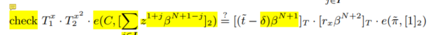

# 31 行
  
  证明 <a_L, d_J> for j in _I 是承诺向量中的元素
  
  注意到 pointproof 同承诺聚合的证明写法如下图：

  

  而我们的第一个检查：
  

  我们把检查分为
    
    - L1 = T_1^x
    - L2 = T_2^(x^2)
    - L3 = e(C, ...)
    - R1 = [(t^~ - delta) beta ^ (N+1)]_T
    - R2 = [r_x beta ^ (N+2)]_T
    - R3 = e(pi^~, [1]_2)

    其中

      - L3 对应聚合证明中的左边部分
      - R3 对应聚合证明右侧一式
      - R1 + R2 - L1 - L2 是项 <a_L, d_J> for j in _I，对应聚合证明的右侧二式

# 32 行
  
  check 2，验证 qs 是函数 f() 在点 s 处的解

# 33 行

  check 3，验证 l * r = t^~